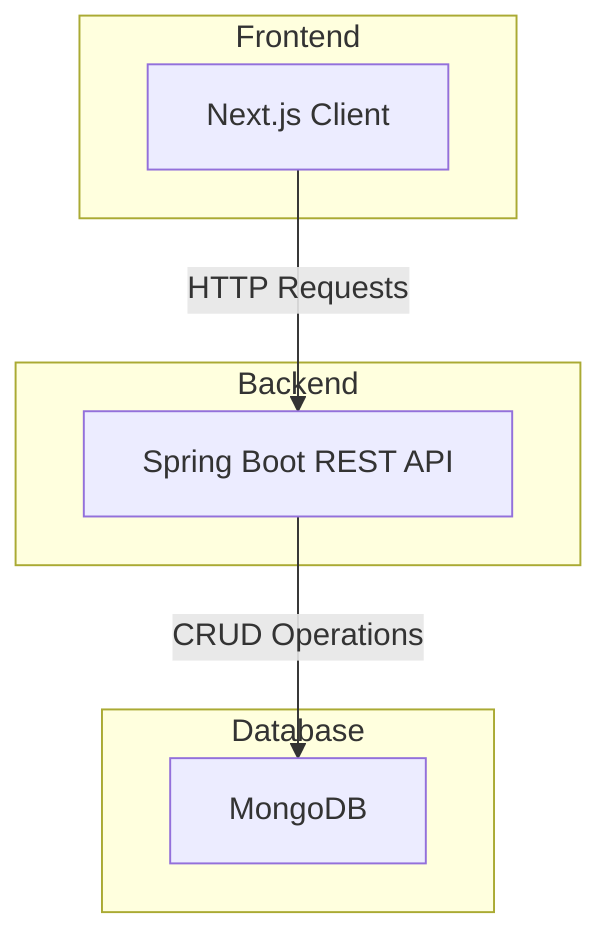

██████╗ ███████╗██████╗ ██████╗ 
██╔══██╗██╔════╝██╔══██╗██╔══██╗
██║  ██║█████╗  ██████╔╝██████╔╝
██║  ██║██╔══╝  ██╔══██╗██╔═══╝ 
██████╔╝███████╗██║  ██║██║     
╚═════╝ ╚══════╝╚═╝  ╚═╝╚═╝     

# DERP - A Modern College ERP System

Welcome to DERP, a full-stack College Enterprise Resource Planning (ERP) system designed to streamline administrative and academic processes. This project provides a robust backend powered by Spring Boot and a sleek, responsive frontend built with Next.js.

## Architecture Overview

The application follows a classic client-server architecture. The Next.js frontend communicates with the Spring Boot backend via a RESTful API. The backend handles all business logic and interacts with a MongoDB database for data persistence.



## Tech Stack

This project leverages a modern technology stack for both the backend and frontend.

| **Area**      | **Technology**                                                              | **Purpose**                               |
| :------------ | :-------------------------------------------------------------------------- | :---------------------------------------- |
| **Backend**   | **Java 17 & Spring Boot 3**                                                 | Core application framework                |
|               | **Spring Security**                                                         | Authentication and Authorization          |
|               | **Spring Data MongoDB**                                                     | Database interaction                      |
|               | **Maven**                                                                   | Dependency Management                     |
| **Frontend**  | **Next.js 15 & React 19**                                                   | Client-side application framework         |
|               | **TypeScript**                                                              | Type safety in code                       |
|               | **Tailwind CSS 4 & shadcn/ui**                                              | UI styling and component library          |
|               | **React Hook Form & Zod**                                                   | Form handling and schema validation       |
| **Database**  | **MongoDB**                                                                 | NoSQL database for storing application data|


## Features

The system supports two main roles: **Admin** and **Student**.

| Feature                | Admin | Student | Description                                                                 |
| :--------------------- | :---: | :-----: | :-------------------------------------------------------------------------- |
| **User Registration**  |   ✅   |    ✅    | Users can register for an account.                                          |
| **Login/Logout**       |   ✅   |    ✅    | Secure authentication for all users.                                        |
| **Student Management** |   ✅   |    ❌    | Admins can create, read, update, and delete student records.                |
| **Course Management**  |   ✅   |    ✅    | Admins manage the course catalog; students can view available courses.       |
| **Attendance Tracking**|   ✅   |    ❌    | Admins can record and manage student attendance.                            |
| **Grade Management**   |   ✅   |    ✅    | Admins can assign grades; students can view their grades.                   |


## Data Models

The core of the application revolves around these data models:

*   **User**: Represents a user account with credentials (`username`, `password`) and roles (`ADMIN`, `STUDENT`).
*   **Student**: Stores personal information about a student (`firstName`, `lastName`, `email`, `studentIdNumber`).
*   **Course**: Contains details about a course (`courseCode`, `courseName`, `description`, `credits`).
*   **AttendanceRecord**: Tracks a student's attendance for a specific class on a given date.
*   **Grade**: Links a student to a course with an assigned grade.


## Prerequisites

Before you begin, ensure you have the following installed:
*   **JDK 17**: Java Development Kit, version 17 or later.
*   **Maven**: For building the backend and managing its dependencies.
*   **Node.js**: Version 20 or later for the frontend.
*   **MongoDB**: A running MongoDB instance. You can install it locally or use a cloud service. For local development, Docker is a great option.

## Getting Started

Follow these instructions to get the project up and running on your local machine.

### 1. Backend Setup

First, navigate to the backend directory:
```bash
cd backend
```

The backend needs to connect to a MongoDB database. You will need to create an `application.properties` file inside `src/main/resources` and add your database connection details.

Create `src/main/resources/application.properties` and add the following:
```properties
spring.data.mongodb.uri=mongodb://localhost:27017/derp
```
*(Adjust the URI if your MongoDB instance is running elsewhere)*

Now, you can run the backend server:
```bash
./mvnw spring-boot:run
```
The backend API will be available at `http://localhost:8080`.

### 2. Frontend Setup

In a new terminal, navigate to the frontend directory:
```bash
cd frontend
```

Install the required npm packages:
```bash
npm install
```

Run the frontend development server:
```bash
npm run dev
```
The frontend will be available at `http://localhost:3000`. You can use the following credentials to test:
*   **Admin**: `adminuser` / `adminpass`
*   **Student**: `studentuser` / `studentpass`

## API Endpoints

The backend provides a RESTful API for managing the ERP's resources. For detailed information on each endpoint, including request/response examples, please see the `backend/routes.md` file.

*   `/api/auth` - User registration and login.
*   `/api/students` - Student management (Admin only).
*   `/api/courses` - Course management (Admin for CRUD, Student for Read).
*   `/api/attendance` - Attendance tracking (Admin only).

## Contributing

Contributions are welcome! If you'd like to contribute, please fork the repository and use a feature branch. Pull requests are warmly welcome.

## License

This project is open-source and available under the [MIT License](LICENSE). 